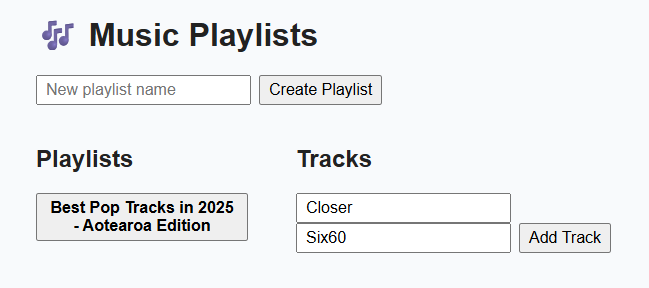

# Music Playlist API  

  
  
  

---

## Overview
A Music Playlist API is a project built with .NET 8 minimal APIs that allows users to create playlists, add or remove tracks, and fetch playlist details.  

It demonstrates:
- Event-driven architecture with pluggable event buses (InMemory, RabbitMQ, Kafka)  
- Automated testing using xUnit and FluentAssertions  
- CI/CD pipelines with GitHub Actions  
- Error handling and edge-case coverage for reliability  
- An optional React + Vite frontend for visualisation  

---
## Screenshot (Live Action)



---
## Architecture

The solution is organised into several key components:

- **API Layer:**  
     Implements .NET 8 minimal APIs for playlist and track management. Handles HTTP requests, validation, and response formatting.

- **Event Bus:**  
     Abstracts event publishing and consumption. Supports multiple implementations:
     - InMemory (default, for development/testing)
     - RabbitMQ (for production-grade messaging)
     - Kafka (for high-throughput scenarios)

- **Domain Layer:**  
     Contains core business logic, domain models, and event definitions.

- **Persistence:**  
     Uses Entity Framework Core with an in-memory or SQL database for storing playlists and tracks.

- **Frontend (Optional):**  
     A React + Vite app for interacting with the API and visualizing playlists.

---

## Getting Started

### Prerequisites

- [.NET 8 SDK](https://dotnet.microsoft.com/download)
- [Node.js](https://nodejs.org/) (for frontend)
- [Docker](https://www.docker.com/) (optional, for RabbitMQ/Kafka)

### Running the API

```bash
dotnet run --project src/MusicPlaylist.Api
```

### Running the Frontend

```bash
cd frontend
npm install
npm run dev
```

---

## Configuration

You can switch the event bus implementation via `appsettings.json` or environment variables:

```json
"EventBus": {
     "Type": "InMemory" // or "RabbitMQ", "Kafka"
}
```

---

## Testing

Run all tests with:

```bash
dotnet test
```

---

## Contributing

Contributions are welcome! Please open issues or submit pull requests.

---

## License

This project is licensed under the MIT License.
